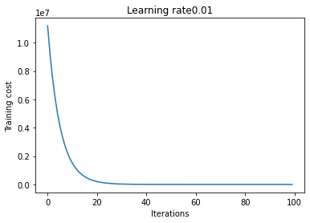
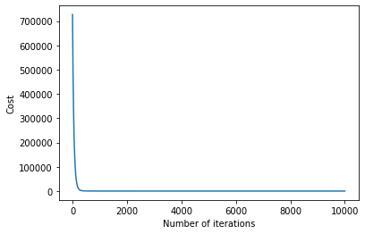

# Machine Learning bootcamp for Winter of Code 4.0 🚀

The main objective of the Machine Learning Bootcamp project is to build a robust machine learning library from scratch. It is then compared against automated machine learning models from the Scikit-Learn library to measure its efficiency.

## Authors 😉

- [Gaurav Bhardwaj](https://github.com/gaurav-bhardwaj29)

## Tech Stack 🖥️

 - Python
 - Google Colab
 - Jupyter Notebook

## Implementation

### Linear Regression
Implementing Linear Regression was straightforward. At first, I made hypothesis and cost function for calculating label and loss at each step respectively, followed by gradient descent. I also tried mini batch gradient descent but it was performing worse than regular gradient descent. Then I standardized the features and finally, calculated RMSE on test set: it turned out to be 74.717, very close to Sklearn's 74.710.

### Polynomial Regression
The implementation of Polynomial Regression is similar to Linear regression. I created additional feature columns of x^2, y^2, and z^2, but the performance was not upto the mark. Then I was advised by my mentor to add xy, yz and zx columns as well, and it drastically improved the model's performance. At the end, with the help of some feature engineering I was able to get a `R2-score` of 0.99 and RMSE around 12.
.png)
### Logistic Regression
This was by far the most challenging task as it took me about a week to complete the alogorithm. As I was doing ONE vs ALL classification task, I started by creating a binary classifier for each letter in training and testing sample. While calculating cost, I was getting a runtime warning in log, which I managed to eliminate by adding a small constant inside log. At last, I got an average accuracy of 96.35 % on test set.
### K-Nearest Neighbours
The theory behind KNN is simple. First we have to calculate equiledian distance between test instance and training set. Then it sorts k nearest neighbours and votes among them for the most common class label. I did a `Gridsearch` using sklearn to find optimum value of K which turned out to be 5. Then I used it for training and got an accuracy of 84.18 % compared to sklearn's accuracy of 84.28 %.
### K-means Clustering
This was the only unsupervised algorithm so I kept it for the end. At first, I randomly assigned K cluster centroids and then  moved the centroids to the mean positions of their respective clusters. I also utilised elbow method to find optimum K. Finally, the model returned accuracy of 55 %.
### Neural Network 🥲
Theoretically, this alogithm took the most amount of time as I had difficulty in understanding concepts. After clearing my concepts, I was able to construct a neural network with one hidden layer(using `tanh` activation function) and one `softmax` layer. After tweeking the parameters, I found best accuracy with learning rate of 1.0 and number of iterations = 1000. The accuracy turned out to be 73 % on EMNIST test dataset. For regression, I changed the activation function to identity function. Finally I got RMSE of 12.01 on polynomial dataset and about 71 on linear dataset.

## Acknowledgements 🤝

 - [Stack Overflow](https://stackoverflow.com/)
  - [How to write a Good readme](https://bulldogjob.com/news/449-how-to-write-a-good-readme-for-your-github-project)

